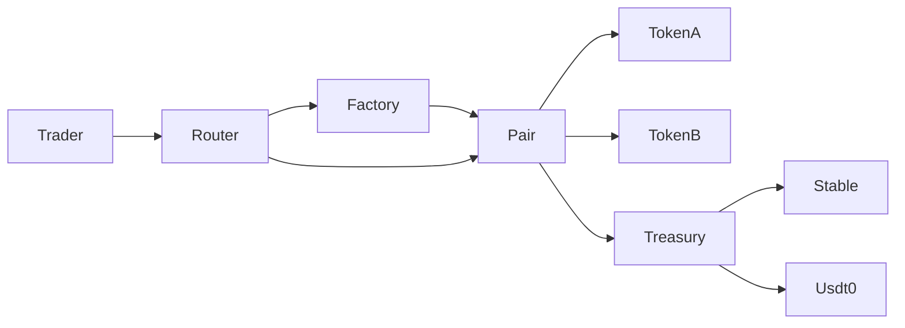

# GASSSS Swap

GASSSS Swap is a minimal Uniswap V2 style AMM deployment tailored for Stable Mainnet, where the gas token `gUSDT` is exposed as an ERC20 like contract at a canonical address. The focus is predictable pool addressing, token only routing, and compatibility with the chain native ERC20.

## Supported assets and pools
- gUSDT native ERC20 `0x0000000000000000000000000000000000001000`
- STABLE governance token `0x0000000000000000000000000000000000001003`
- USDT0 `0x779Ded0c9e1022225f8E0630b35a9b54bE713736`

Pools
- gUSDT and STABLE
- USDT0 and STABLE
- TBD

## Key design choices
- Token only router: no ETH or WETH paths, all operations are ERC20 to ERC20.
- Chain native ERC20 support.

## Protocol fees and treasury
Protocol fee follows Uniswap V2 feeOn. When `feeTo` is set on the Factory, protocol fees are minted as LP tokens to the Treasury during mint and burn events. Treasury can later rebalance assets into STABLE and USDT0 using the Router.

## Mainnet deployments
| Component | Address |
| --- | --- |
| Multicall2 | `0xF15f48aA99EB462944298942c1Cd9fECDd233beD` |
| UniswapV2Factory | `0x603EfDF29606BfB90f8f1068828c79cB2d5eD056` |
| GassssRouter | `0x74FcEb3e5acAe9868A265C75e033630cEC165cD0` |
| GassssTreasury | `0x969b887e7259a263DC00dCAe91468Ce69FE1BE53` |
| Pair gUSDT STABLE | `0x4Bd0F64D6E2464e490a74F8C3537eB82E4EBe14c` |
| Pair USDT0 STABLE | `0xacF129cf0BF8175351a2fE50D67D32200ccA0937` |
